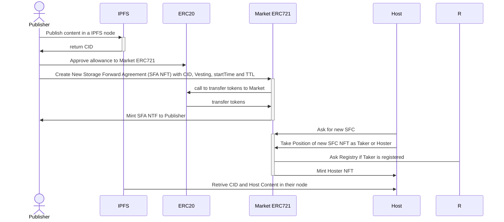
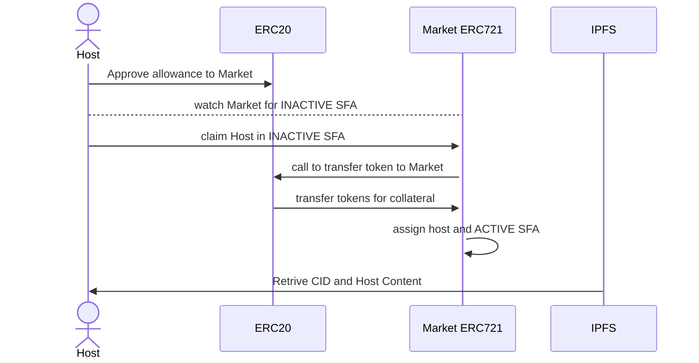
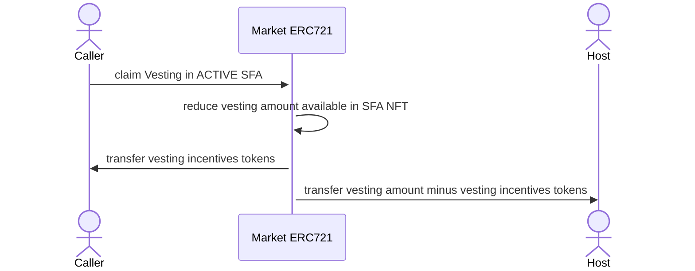
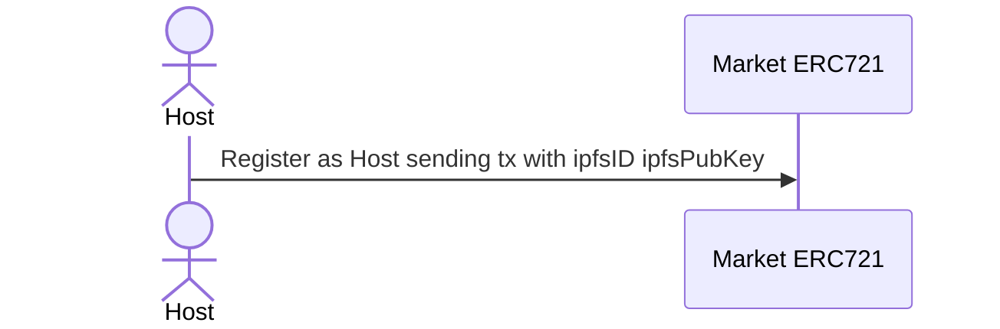
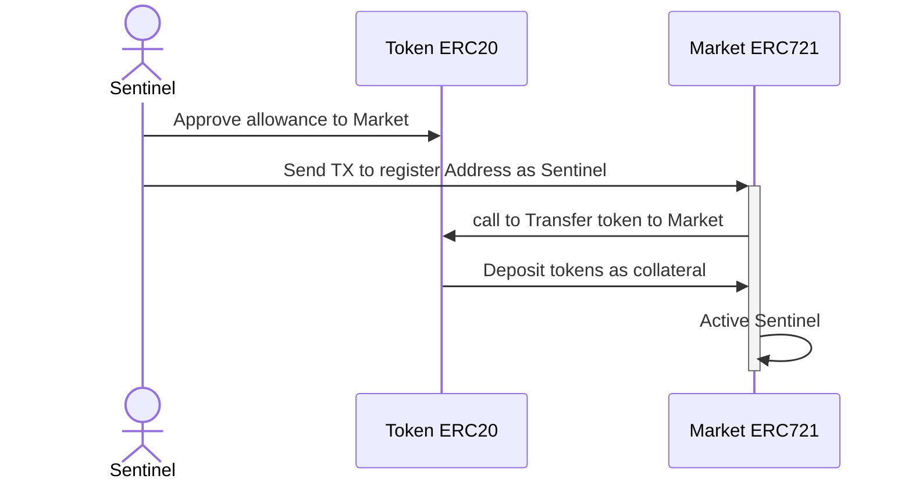

# protocol

Decentralized Storage Market Protocol

# Use Cases Sequence Diagrams

## Create SFA

## Take position in SFA (only hosts)

## Claim Vesting in SFA

call for available vesting in SFA NFT is open to public in base of incentives to caller, so in this way we can incentive market to automate and keep token rolling.
caller get a ratio participation of vesting amount tranfered

## Register as Host

## Register as Sentinel

