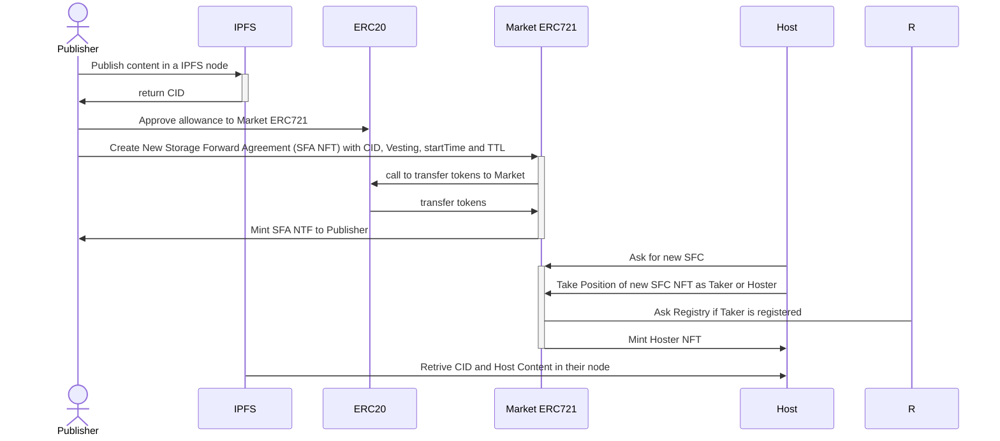
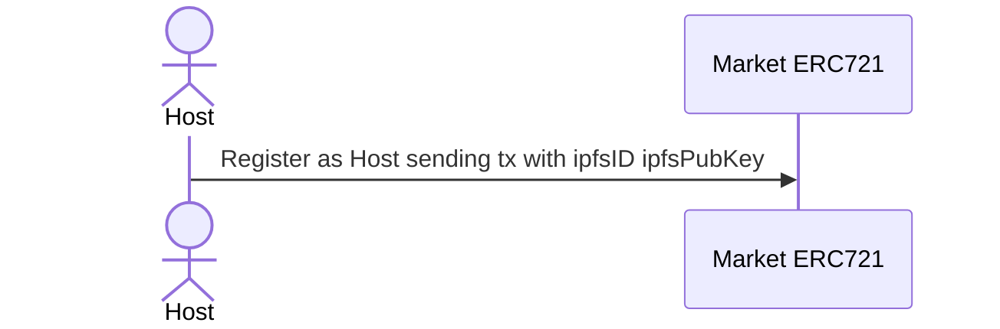
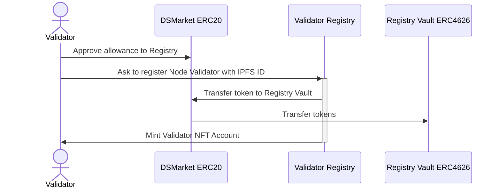

# protocol

Decentralized Storage Market Protocol

# Use Cases Sequence Diagrams

## Create SFA

```mermaid
sequenceDiagram
    actor P as Publisher
    participant IPFS
    participant T as ERC20
    participant M as Market ERC721
    participant H as Host


    P ->>+ IPFS: Publish content in a IPFS node
    IPFS ->>- P: return CID
    P ->> T: Approve allowance to Market ERC721
    P ->>+ M: Create New Storage Forward Agreement (SFA NFT) with CID, Vesting, startTime and TTL
    M ->> T: call to transfer tokens to Market
    T ->> M: transfer tokens
    M ->>- P: Mint SFA NTF to Publisher

    H ->>+ M: Ask for new SFC
    H ->> M: Take Position of new SFC NFT as Taker or Hoster
    M -> R: Ask Registry if Taker is registered
    M ->>- H: Mint Hoster NFT
    IPFS ->> H: Retrive CID and Host Content in their node
```

## Register as Host

```mermaid
sequenceDiagram
    Actor H as Host
    participant M as Market ERC721

    H ->> M: Register as Host sending tx with ipfsID ipfsPubKey
```

## Register as Validator

```mermaid
sequenceDiagram
    Actor V as Validator
    participant T as DSMarket ERC20
    participant R as Validator Registry
    participant RV as Registry Vault ERC4626


    V ->> T: Approve allowance to Registry

    V ->>+ R: Ask to register Node Validator with IPFS ID
    R ->> T: Transfer token to Registry Vault
    T ->> RV: Transfer tokens
    R ->>- V: Mint Validator NFT Account
```
